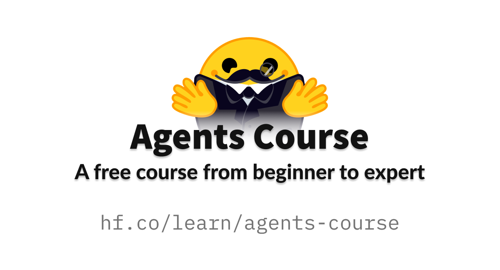

# The Hugging Face Agents Course



Course Related Links:

- [Official Website](https://huggingface.co/agents-course)
  - [Welcome to the 🤗 AI Agents Course - Hugging Face Agents Course](https://huggingface.co/learn/agents-course/en/unit0/introduction)
- [Sign up](https://bit.ly/hf-learn-agents)
- [YouTube Playlist](https://youtube.com/playlist?list=PLo2EIpI_JMQvNwIEfFWkqFrKdFr-ikRUP&si=3dPnoV9GmDQNAwTL)
- [GitHub](https://github.com/huggingface/agents-course)
- [Discord](https://discord.gg/UrrTSsSyjb)

Authors

- Joffrey Thomas
- Ben Burtenshaw
- Thomas Simonini

## Getting Started

```bash
# Make sure you have git-lfs installed (https://git-lfs.com)
brew install git-lfs
# For Hugging Face repository/space, now as submodules of this repository
git lfs install

# https://packaging.python.org/en/latest/guides/installing-using-pip-and-virtual-environments/
python -m venv .venv
source .venv/bin/activate

# https://huggingface.co/docs/transformers/installation
pip install -r requirements.txt

cp .env.example .env
# Setup Hugging Face API key
# https://hf.co/settings/tokens
```

## Schedule


| Week           | Unit | Topic                                                                                      | Lectures | Quiz                                                                          | Assignments |
| -------------- | ---- | ------------------------------------------------------------------------------------------ | -------- | ----------------------------------------------------------------------------- | ----------- |
| 2025/2/10~2/16 | 0    | [Welcome to the Course](https://huggingface.co/learn/agents-course/en/unit0/introduction)  | -        | -                                                                             | -           |
| 2025/2/17~2/23 | 1    | [Introduction to Agents](https://huggingface.co/learn/agents-course/en/unit1/introduction) | -        | [Unit 1 Quiz](https://huggingface.co/learn/agents-course/en/unit1/final-quiz) | -           |
| 2025/2/24~3/9  | 2    | [2_frameworks](units/en/unit2/README.md)                                                   | -        | -                                                                             | -           |
| 2025/3/10~3/31 | 3    | [3_use_cases](units/en/unit3/README.md)                                                    | -        | -                                                                             | -           |
| 2025/4/1~4/30  | 4    | [4_final_assignment_with_benchmark](units/en/unit4/README.md)                              | -        | -                                                                             | -           |

### Unit 0. Welcome to the Course

> Welcome, guidelines, necessary tools, and course overview.

- [Welcome To The Agents Course! Introduction to the Course and Q&A - YouTube](https://www.youtube.com/watch?v=PopqUt3MGyQ&list=PLo2EIpI_JMQvNwIEfFWkqFrKdFr-ikRUP&index=1) (2025/2/13 00:00 UTC+8)

1. [X] [Welcome to the 🤗 AI Agents Course](https://huggingface.co/learn/agents-course/en/unit0/introduction)
2. [X] [Onboarding: Your First Steps ⛵](https://huggingface.co/learn/agents-course/en/unit0/onboarding)
   1. [X] [Create your Hugging Face Account](https://huggingface.co/)
   2. [X] [Sign up to Discord and introduce yourself](https://discord.gg/UrrTSsSyjb)
   3. [X] [Follow the Hugging Face Agents Course](https://huggingface.co/agents-course)
   4. [X] [Spread the word about the course](https://github.com/huggingface/agents-course)
3. [X] [(Optional) Discord 101](https://huggingface.co/learn/agents-course/en/unit0/discord101)

### Unit 1. Introduction to Agents

> Definition of agents, LLMs, model family tree, and special tokens.


1. [X] [Introduction to Agents](https://huggingface.co/learn/agents-course/en/unit1/introduction)
   - **Understanding Agents**
     - What is an Agent, and how does it work?
     - How do Agents make decisions using reasoning and planning?
   - **The Role of LLMs (Large Language Models) in Agents**
     - How LLMs serve as the “brain” behind an Agent.
     - How LLMs structure conversations via the Messages system.
   - **Tools and Actions**
     - How Agents use external tools to interact with the environment.
     - How to build and integrate tools for your Agent.
   - **The Agent Workflow:**
     - _Think_ → _Act_ → _Observe_.
2. [X] [What is an Agent?](https://huggingface.co/learn/agents-course/en/unit1/what-are-agents)
   - An Agent is a system that leverages an AI model to interact with its environment in order to achieve a user-defined objective. It combines reasoning, planning, and the execution of actions (often via external tools) to fulfill tasks.
     1. The Brain (AI Model)
        - LLM (Large Language Model): e.g. GPT4 from OpenAI, LLama from Meta, Gemini from Google, ...
        - VLM (Vision Language Model)
     2. The Body (Capabilities and Tools)
   -  To summarize, an Agent is a system that uses an AI Model (typically a LLM) as its core reasoning engine, to
      - Understand natural language: Interpret and respond to human instructions in a meaningful way.
      - Reason and plan: Analyze information, make decisions, and devise strategies to solve problems.
      - Interact with its environment: Gather information, take actions, and observe the results of those actions.
3. [X] [Small Quiz (ungraded)](https://huggingface.co/learn/agents-course/en/unit1/quiz1) (Quick Quiz 1)
4. [X] [What are LLMs?](https://huggingface.co/learn/agents-course/en/unit1/what-are-llms)
   - [tokenizer_config.json · HuggingFaceTB/SmolLM2-135M-Instruct at main](https://huggingface.co/HuggingFaceTB/SmolLM2-135M-Instruct/blob/main/tokenizer_config.json)
5. [X] [Messages and Special Tokens](https://huggingface.co/learn/agents-course/en/unit1/messages-and-special-tokens)
   - [openai-python/chatml.md at release-v0.28.0 · openai/openai-python](https://github.com/openai/openai-python/blob/release-v0.28.0/chatml.md) (ChatML template format)
   - [Chat Templates](https://huggingface.co/docs/transformers/en/chat_templating#how-do-i-use-chat-templates) (`chat_template` is usually in the model's tokenizer)
   - [🤗 Transformers](https://huggingface.co/docs/transformers/index)
6. [X] [What are Tools?](https://huggingface.co/learn/agents-course/en/unit1/tools)
   - A Tool should contain:
     - A **textual description of what the function does**.
     - A _Callable_ (something to perform an action).
     - _Arguments_ with typings.
     - (Optional) Outputs with typings.
   - The tool description is injected in the system prompt.
     - What the tool does
     - What exact inputs it expects
7. [X] [Quick Self-Check (ungraded)](https://huggingface.co/learn/agents-course/en/unit1/quiz2) (Quick Quiz 2)
8. [X] [Understanding AI Agents through the Thought-Action-Observation Cycle](https://huggingface.co/learn/agents-course/en/unit1/agent-steps-and-structure)
   - Agents work in a continuous cycle of: **thinking (Thought) → acting (Act) and observing (Observe)**.
     1. **Thought**: The LLM part of the Agent decides what the next step should be.
     2. **Action:** The agent takes an action, by calling the tools with the associated arguments.
     3. **Observation:** The model reflects on the response from the tool.
9. [X] [Thought: Internal Reasoning and the Re-Act Approach](https://huggingface.co/learn/agents-course/en/unit1/thoughts)
   - [ReAct](https://arxiv.org/abs/2210.03629) ([papers.cool](https://papers.cool/arxiv/2210.03629)): “Reasoning” (Think) with “Acting” (Act)
     - ReAct is a simple prompting technique that appends “Let’s think step by step” before letting the LLM decode the next tokens.
     - We have recently seen a lot of interest for reasoning strategies. This is what's behind models like Deepseek R1 or OpenAI's o1, which have been fine-tuned to "think before answering".
10. [X] [Actions: Enabling the Agent to Engage with Its Environment](https://huggingface.co/learn/agents-course/en/unit1/actions)
   - One key method for implementing actions is the **Stop and Parse Approach**. This method ensures that the agent’s output is structured and predictable:
     1. Generation in a Structured Format: The agent outputs its intended action in a clear, predetermined format (JSON or code).
     2. Halting Further Generation: Once the action is complete, the agent stops generating additional tokens. This prevents extra or erroneous output.
     3. Parsing the Output: An external parser reads the formatted action, determines which Tool to call, and extracts the required parameters.
   - An alternative approach is using **Code Agents**. The idea is: instead of outputting a simple JSON object, a Code Agent generates an executable code block—typically in a high-level language like Python.
     - Expressiveness: Code can naturally represent complex logic, including loops, conditionals, and nested functions, providing greater flexibility than JSON.
     - Modularity and Reusability: Generated code can include functions and modules that are reusable across different actions or tasks.
     - Enhanced Debuggability: With a well-defined programming syntax, code errors are often easier to detect and correct.
     - Direct Integration: Code Agents can integrate directly with external libraries and APIs, enabling more complex operations such as data processing or real-time decision making.
11. [X] [Observe: Integrating Feedback to Reflect and Adapt](https://huggingface.co/learn/agents-course/en/unit1/observations)
   - Observations are how an Agent perceives the consequences of its actions.
     - Collects Feedback: Receives data or confirmation that its action was successful (or not).
     - Appends Results: Integrates the new information into its existing context, effectively updating its memory.
     - Adapts its Strategy: Uses this updated context to refine subsequent thoughts and actions.
   - After performing an action, the framework follows these steps in order:
     1. Parse the action to identify the function(s) to call and the argument(s) to use.
     2. Execute the action.
     3. Append the result as an Observation.
12. [ ] [Dummy Agent Library](https://huggingface.co/learn/agents-course/en/unit1/dummy-agent-library) (TODO: solve the hallucination issue)
   - [dummy_agent_library.ipynb · agents-course/notebooks at main](https://huggingface.co/agents-course/notebooks/blob/main/dummy_agent_library.ipynb) ([open in Google Colab](https://colab.research.google.com/#fileId=https://huggingface.co/agents-course/notebooks/blob/main/dummy_agent_library.ipynb)) => [Modified Version](https://colab.research.google.com/drive/1SzN6jyQpldIXF-eNPP1_vnKv4ivLJRG7?usp=sharing)
   - The `chat` method is the RECOMMENDED method to use in order to ensure a smooth transition between models
   - If use `text_generation` method, we need to provide prompt (e.g. special tokens for the specific model) properly
13. [ ] [Let’s Create Our First Agent Using smolagents](https://huggingface.co/learn/agents-course/en/unit1/tutorial)
    - smolagents is a library that focuses on codeAgent, a kind of agent that performs “Actions” through code blocks, and then “Observes” results by executing the code.
    - [Introducing smolagents: simple agents that write actions in code.](https://huggingface.co/blog/smolagents)
    - [Agent process - YouTube](https://www.youtube.com/watch?v=PQDKcWiuln4)
    - Duplicate this space: [First Agent Template - a Hugging Face Space by agents-course](https://huggingface.co/spaces/agents-course/First_agent_template)
      - Modify this incomplete code: [app.py · agents-course/First_agent_template at main](https://huggingface.co/spaces/agents-course/First_agent_template/blob/main/app.py)
14. [ ] [**Unit 1 Quiz**](https://huggingface.co/learn/agents-course/en/unit1/final-quiz)
15. [ ] [Get your certificate](https://huggingface.co/learn/agents-course/en/unit1/get-your-certificate)
16. [ ] [Conclusion](https://huggingface.co/learn/agents-course/en/unit1/conclusion)

### Unit 2.

> Overview of smolagents, LangChain, LangGraph, and LlamaIndex.

### Unit 3.

> SQL, code, retrieval, and on-device agents using various frameworks.

### Unit 4.

> Automated evaluation of agents and leaderboard with student results.

## Resources

- `smolagents`
  - [Smolagents : Huggingface AI Agent Framework](https://smolagents.org/)
  - [huggingface/smolagents: 🤗 smolagents: a barebones library for agents. Agents write python code to call tools and orchestrate other agents.](https://github.com/huggingface/smolagents)
  - [smolagents](https://huggingface.co/docs/smolagents/index)
